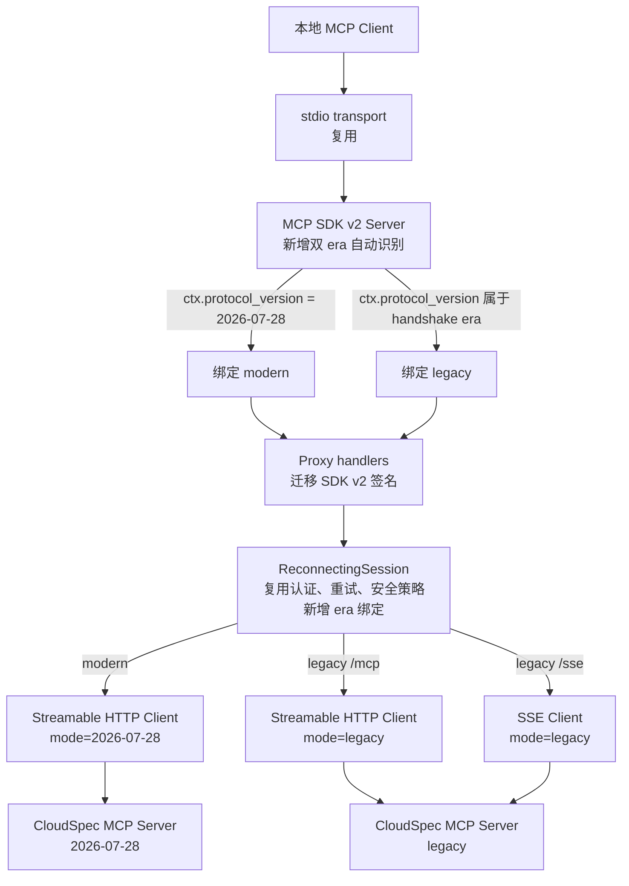
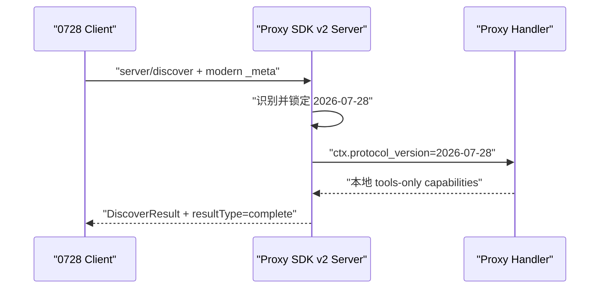
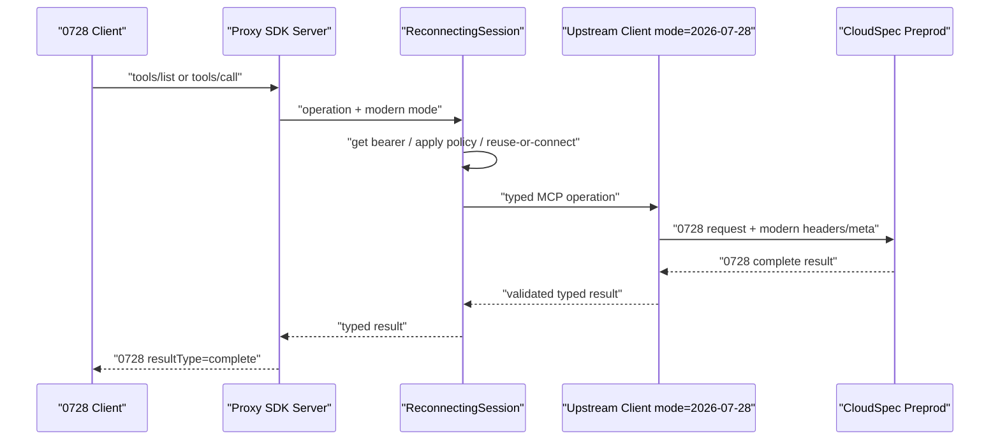
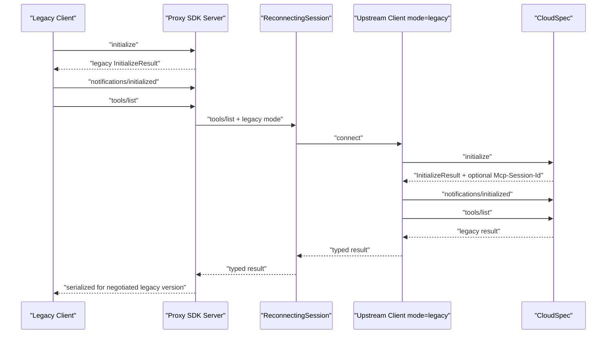
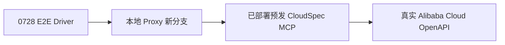

# MCP Proxy 2026-07-28 双协议适配设计

## 1. 背景

Alibaba Cloud MCP Proxy 当前基于 MCP Python SDK v1，只支持以
`initialize` 为起点的旧协议。CloudSpec MCP Server 已在保持旧协议能力的同时，
部署了 MCP `2026-07-28` 协议到预发环境。

本次改造要让同一份 Proxy 代码同时服务：

- MCP `2026-07-28` 客户端；
- 现有 handshake-era MCP 客户端；
- 预发 CloudSpec MCP Server 的 `2026-07-28` 和旧协议入口。

这里所说的 “MCP 2.0” 指 MCP Python SDK v2；正式协议版本名仍是
`2026-07-28`。

## 2. 目标与非目标

### 2.1 目标

1. 不增加服务端点，不增加必填 CLI 参数或环境变量。
2. 本地 stdio 入口自动识别 `2026-07-28` 与旧协议。
3. 上游 CloudSpec 默认同时支持新旧协议，Proxy 不探测、不降级。
4. 下游是 modern era 时，上游固定使用 `2026-07-28`。
5. 下游是 legacy era 时，上游继续使用 legacy initialize 握手。
6. `2026-07-28` 首期支持：
   - `server/discover`
   - `tools/list`
   - `tools/call`
   - `resultType: complete`
7. 保持现有认证、token 刷新、安全策略、重连、SSE 恢复和 session marker 行为。
8. 使用本地 Proxy 连接已部署的预发 CloudSpec，完成两端联合端到端测试。

### 2.2 非目标

本期不实现：

- MRTR / `input_required`
- Tasks extension
- MCP Apps
- `subscriptions/listen`
- modern prompts/resources
- modern over legacy HTTP+SSE transport
- 上游协议能力探测
- modern 失败后自动降级 legacy
- Proxy 内部的 tmpAK 获取或缓存

## 3. 已选方案

### 3.1 方案

整个 Proxy 迁移到官方 MCP Python SDK v2，由 SDK 同时处理 modern 和
legacy wire protocol。

下游 handler 使用 SDK 提供的 `ctx.protocol_version` 识别 era，并把 era
显式传给 `ReconnectingSession`。上游 Client 根据该 era 固定选择：

```text
2026-07-28 -> mode="2026-07-28"
legacy     -> mode="legacy"
```

不使用上游 `mode="auto"`。

### 3.2 未选择的方案

1. **手工实现 2026-07-28 JSON-RPC 和 HTTP headers**
   - 需要自行维护 `_meta`、routing headers、wire schema 和 result serialization；
   - 容易遗漏版本校验与旧协议过滤。

2. **同时运行 SDK v1 和 SDK v2 两套进程或入口**
   - 会增加进程、路由、认证和故障恢复复杂度；
   - 不符合单端点、单份代码的目标。

3. **上下游分别自动协商**
   - 可能产生 modern 下游连接到 legacy 上游，或 legacy 下游连接到 modern 上游；
   - 会引入不必要的跨 era 适配；
   - 不符合“默认上游已支持两种协议”的前提。

## 4. 总体架构



Proxy 仍然是 MCP 连接的两端终止者：本地一侧是 MCP Server，上游一侧是 MCP
Client。它会解析并重新发起 `tools/list` 或 `tools/call`，但不会在 modern 和
legacy 两个 era 之间主动转换。

## 5. 协议识别与 era 绑定

### 5.1 下游识别

SDK v2 的 `Server.run()` 自带 dual-era loop：

- 第一条 request 是 `initialize`：连接锁定为 legacy；
- 第一条非 `initialize` request 带完整 modern `_meta`：连接锁定为 modern；
- modern 客户端可以先调用 `server/discover`，也可以直接调用带完整 envelope
  的 `tools/list`；
- era 一旦锁定，后续混入另一个 era 的消息由 SDK 拒绝。

Proxy 不新增自定义首包解析器或进程级 era detector。

handler 的唯一权威版本来源是：

```python
ctx.protocol_version
```

判断 modern 必须使用 SDK 的 modern version 集合，不通过字符串日期比较、
session ID 或 transport 类型推断。

### 5.2 上游模式

定义一个小型内部类型：

```python
ProtocolMode = Literal["2026-07-28", "legacy"]
```

映射规则：

```python
def to_upstream_mode(protocol_version: str) -> ProtocolMode:
    if protocol_version in MODERN_PROTOCOL_VERSIONS:
        return "2026-07-28"
    return "legacy"
```

这里绑定的是 era，不保证所有 legacy 日期逐字一致：

- modern 上游精确固定为 `2026-07-28`；
- legacy 上游仍由 SDK 发起 initialize，并与服务端协商具体旧版本；
- 这与现有 Proxy 上下游独立 initialize 的行为一致。

### 5.3 单连接约束

当前 Proxy 进程只运行一条本地 stdio 连接，SDK 保证这条连接只能属于一个
era。`ReconnectingSession` 仍增加 `_bound_protocol_mode` 作为防御性约束：

1. 第一次真正访问上游时绑定 mode；
2. 同 mode 的请求复用现有连接；
3. token 刷新或连接重建时继续使用相同 mode；
4. 收到不同 mode 时返回内部一致性错误，不切换、不降级；
5. `aclose()` 时清理连接与绑定。

## 6. 模块设计

### 6.1 依赖

更新直接依赖：

```text
mcp>=2.0.0,<3.0.0
httpx2[socks]>=2.9.1
```

Proxy 直接导入 `httpx2`，因此必须显式声明，不依赖 MCP SDK 的传递依赖。
现有直接 `httpx` 使用点全部迁移后移除旧依赖。

### 6.2 `transport/stdio_server.py`

保留现有 stdio 生命周期：

```text
stdio_server()
-> Server.run()
```

迁移到 SDK v2 后，`Server.run()` 自动同时处理 modern 和 legacy，不新增入口、
端口或启动参数。

### 6.3 `proxy/server.py`

SDK v1 decorator handler 迁移为 SDK v2 constructor `on_*` handlers。每个
handler 接收：

```text
ServerRequestContext
typed request params
```

主要行为：

- 从 `ctx.protocol_version` 计算 `ProtocolMode`；
- 把 mode 显式传给 `ReconnectingSession`；
- 保留现有 MCPError 透传；
- 保留非 MCP 异常包装为 `INTERNAL_ERROR`；
- 保留 resource text/blob 结果处理。

legacy 继续注册：

- `prompts/list`
- `prompts/get`
- `resources/list`
- `resources/read`
- `tools/list`
- `tools/call`

modern 的自定义 `server/discover` 只声明 tools capability。modern
prompts/resources 请求明确返回不支持，不转发上游；这不改变任何存量 legacy
行为。

SDK v2 的默认 discover handler 会从全部已注册 handler 推导 capabilities，
因此不能直接使用。Server 构造完成后，Proxy 必须通过
`add_request_handler("server/discover", ...)` 显式替换内置 handler，并返回只含
tools capability 的自定义 `DiscoverResult`。legacy initialize capabilities
仍由全部已注册 handler 推导，所以 prompts/resources/tools 的存量声明不变。

`server/discover` 描述的是 Proxy 对本地客户端提供的静态协议契约，因此：

- 在 Proxy 本地完成；
- 不连接 CloudSpec；
- 不获取 bearer token；
- 不探测上游；
- SDK 负责添加 `resultType`、server identity `_meta` 和版本相关 wire 字段。

### 6.4 `session/reconnecting_session.py`

保留以下现有逻辑：

- 懒连接；
- 活连接复用；
- 单锁串行化；
- 指数退避；
- 401/403/unauthorized 时 force refresh；
- 失败连接先从共享状态摘除，再在锁外关闭；
- `ProxyDependencyError` 直接抛出；
- safety policy 和 allowed tools 在连接前应用；
- safety policy 按 bearer token 去重。

接口增加 `protocol_mode`：

```text
list_tools(protocol_mode=...)
call_tool(..., protocol_mode=...)
list_prompts(protocol_mode=...)
...
```

工厂接口变成：

```text
connect(bearer_token=..., protocol_mode=...)
```

`_bound_protocol_mode` 与连接分开保存。连接失败后可以为同一 mode 重建，但
不能借机切换 mode。

### 6.5 `transport/upstream_http.py`

继续使用 dedicated background task 完整持有：

- `httpx2.AsyncClient`
- `streamable_http_client`
- MCP v2 `Client`
- transport/Client 的 cancel scopes

RPC 仍通过 memory object stream 分发，避免 AnyIO cancel-scope 栈跨 task
泄漏。

modern：

```python
Client(
    transport,
    mode="2026-07-28",
    cache=None,
)
```

固定 modern mode 表示信任上游已支持该协议：

- 不发送 `server/discover`；
- 不发送 `initialize`；
- 不发送 `notifications/initialized`；
- 第一条网络请求就是 `tools/list` 或 `tools/call`；
- SDK 自动写入 modern `_meta`、`MCP-Protocol-Version`、`Mcp-Method` 和
  `Mcp-Name`。

legacy：

```python
Client(
    transport,
    mode="legacy",
    cache=None,
)
```

连接顺序保持：

```text
initialize
-> notifications/initialized
-> business request
```

`cache=None` 避免 SDK v2 的客户端缓存改变现有 Proxy “每次调用访问上游”的
行为。

### 6.6 `transport/upstream_sse.py`

HTTP+SSE 只保留 legacy：

```text
mode="legacy"
```

保留：

- dedicated background worker；
- session-not-found 404 检测；
- POST 5xx 检测；
- transport worker 取消与重建；
- 原 token 是否刷新的判定。

modern 请求配置到 `/sse` 时明确返回 transport 不支持错误，不自动走 legacy。

### 6.7 `transport/http_client.py`

迁移到 `httpx2`，继续保留：

- headers、timeout、auth、redirects；
- event hooks；
- SOCKS proxy 支持；
- SOCKS 依赖缺失时的可操作诊断。

错误信息中的安装提示要与新的直接依赖包一致。

### 6.8 `session_marker.py`

文件本身和写入格式不变。

SDK v2 Streamable HTTP transport 不再公开 v1 的 `get_session_id()`，因此 legacy
HTTP 使用 response hook 捕获 `Mcp-Session-Id` 后调用现有 marker writer。

- legacy 有非空 session ID：保持原 marker 行为；
- modern 没有协议 session：不写 marker；
- 不为 modern 伪造 session ID；
- 不顺带增加旧 marker 清理行为。

## 7. 请求流程

### 7.1 modern `server/discover`



该流程不访问 CloudSpec。

### 7.2 modern `tools/list` / `tools/call`



上游返回缺少 `resultType`、cache fields 或其他必填字段时，SDK 的 0728 wire
schema 校验必须失败，不能把错误响应伪装成成功。

SDK 的统一 Python result model 虽然为 legacy 兼容提供默认值，但 ClientSession
在构造统一 model 前会先按协商版本调用 versioned wire schema 校验。
`2026-07-28` wire model 中这些字段没有默认值，因此本设计不增加第二套 raw
JSON 校验。

### 7.3 legacy



上下游 legacy 握手相互独立，这是现有 Proxy 行为，不是本次新增的跨 era
转换。

## 8. 认证、token 与 tmpAK

Proxy 只负责 bearer token：

```text
Proxy token provider
-> Authorization: Bearer ...
-> CloudSpec authentication
-> CloudSpec 内部换取并使用 tmpAK
```

本次不把 tmpAK 引入 Proxy：

- Proxy 不生成、不缓存、不刷新 tmpAK；
- `server/discover` 不触发 token 获取；
- 第一次真实上游 list/call 才懒获取 token；
- 401/403 保持现有 force-refresh bearer token 行为；
- bearer token 改变后，安全策略按现有逻辑重新应用；
- protocol mode 与 token 生命周期相互独立。

CloudSpec 的 tmpAK 生命周期和复用规则由已部署服务端实现负责，Proxy 不复制
或改变该逻辑。

## 9. 结果与错误处理

### 9.1 结果

- `ListToolsResult` 和 `CallToolResult` 使用 SDK v2 统一模型；
- modern 上游必须返回 `resultType: complete`；
- modern 下游由 SDK 序列化出 `resultType: complete`；
- legacy 下游由 SDK 按协商版本序列化，不要求客户端理解 modern 字段；
- 工具返回 `isError=true` 是正常 MCP result，不触发连接重试。

为了不半实现 MRTR，上游调用使用允许观察 `InputRequiredResult` 的底层接口。
一旦收到 `input_required`，Proxy 返回明确的本期不支持错误，不驱动 sampling、
elicitation 或 roots 回调。

### 9.2 错误矩阵

| 场景 | 行为 |
|---|---|
| 下游 modern envelope/header 无效 | SDK 本地返回协议错误，不访问上游 |
| 上游 401/403 | 按现有策略刷新 bearer 并重连 |
| 上游网络错误、超时、5xx | 按现有指数退避重连 |
| legacy SSE session 404 | 使用原 token 创建新 legacy session |
| modern 请求失败 | 返回错误，不降级 legacy |
| modern 上游结果不符合 0728 schema | SDK 校验失败，最终返回内部错误 |
| 上游返回 `input_required` | 返回本期不支持错误 |
| modern 配置 `/sse` | 返回 transport 不支持错误 |
| handler 收到与已绑定 mode 不一致的请求 | 返回内部一致性错误 |

### 9.3 日志

允许记录：

```text
method
protocol mode
retry attempt
transport kind
HTTP status
session header presence
```

禁止记录：

- bearer token；
- Authorization header；
- 完整工具参数；
- tmpAK；
- 其他凭证。

为了给联合 E2E 提供两段链路证据，Streamable HTTP 增加脱敏 transport 审计：

- request 只提取并记录顶层 MCP method、固定的 protocol mode，以及 session
  header 是否存在；
- response 只记录 HTTP status 和 session header 是否存在；
- 不记录 JSON body、header 值、token、tool name 或 arguments；
- 审计输出进入现有 debug log，不新增遥测端点。

## 10. 存量兼容性

存量兼容合同：

1. CLI 命令、参数和环境变量不变；
2. stdio 启动方式不变；
3. legacy `initialize` 仍然可用；
4. legacy prompts/resources/tools 能力继续注册；
5. legacy 上游继续 initialize；
6. legacy HTTP session ID 和 marker 保留；
7. token 缓存、refresh skew、401/403 refresh 保留；
8. safety policy / allowed tools 保留；
9. HTTP 和 SSE background worker 生命周期保留；
10. SSE 404/503 恢复行为保留；
11. 不新增 silent fallback。

迁移 SDK major version 是主要回归风险，因此不能仅依靠类型检查或 mock
handler 证明兼容，必须增加真实 wire-level legacy 测试。

## 11. 测试设计

实现遵循 TDD：先编写会失败的协议或行为测试，再做最小实现使其通过。

### 11.1 基线

改造前基线：

```text
88 passed
```

完成后现有测试必须全部通过。因 SDK/httpx2 API 变化允许迁移测试夹具，但原有
行为断言不能被删除或弱化。

### 11.2 下游 stdio 协议测试

新增黑盒或完整 stream-level 测试：

1. `server/discover` 首包锁定 modern；
2. modern 可直接以带 envelope 的 `tools/list` 开始；
3. modern discover 只声明 tools；
4. modern list/call 返回 `resultType: complete`；
5. modern 不要求 `initialize`；
6. legacy `initialize` 仍然成功；
7. 参数化覆盖 SDK 支持的 handshake-era 版本；
8. legacy capabilities 保持 prompts/resources/tools；
9. 同一连接混入另一个 era 被拒绝；
10. handler 把正确 mode 传给 session。

### 11.3 上游 HTTP wire 测试

modern：

1. 首个上游请求是业务请求；
2. 不发送 discover/initialize/initialized；
3. 带正确 `_meta`；
4. 带 `MCP-Protocol-Version`、`Mcp-Method` 和适用的 `Mcp-Name`；
5. 不带 `Mcp-Session-Id`；
6. 缺少 modern 必填结果字段时失败；
7. 401/500 不触发 legacy fallback；
8. 重连后仍保持 modern mode。

legacy：

1. initialize/initialized 顺序保持；
2. session ID 继续用于后续请求；
3. marker 继续写入；
4. 401 后 fresh bearer 重连并重新 initialize；
5. token provider 调用和 refresh 断言保持。

### 11.4 SSE 回归

1. 只接受 legacy mode；
2. 404 session-not-found 后重建 session；
3. initialize POST 503 后恢复；
4. pending RPC 收到 worker 原始错误；
5. worker 异常不击穿宿主 TaskGroup；
6. modern + SSE 明确失败。

### 11.5 其他回归

- token refresh skew；
- safety policy 每 token 一次；
- allowed tools；
- resource text/blob；
- MCPError 与 INTERNAL_ERROR；
- SOCKS 依赖诊断；
- package entry points；
- `git diff --check`。

## 12. Proxy 与 CloudSpec 联合端到端测试

联合测试是完成条件，不以单元测试或 mock 代替。

链路：



测试目标通过运行时参数传入，代码和文档不硬编码预发 URL、bearer token 或
其他凭证。

### 12.1 modern 联合测试

1. 从本地新分支源码启动 Proxy，不使用已发布的旧 PyPI 版本；
2. 0728 driver 通过 stdio 连接 Proxy；
3. 调用 `server/discover`；
4. 调用 `tools/list`；
5. 检查 Proxy 安全日志显示上游固定为 `2026-07-28`；
6. 检查响应的 `resultType: complete`；
7. 检查脱敏 transport 审计，确认发往 CloudSpec 的首包是业务请求，且没有
   `server/discover`、`initialize` 或 session header；
8. 调用只读工具，例如产品/定义查询；
9. 调用 `AlibabaCloud___RunScript` 执行只读 `DescribeRegions`；
10. 保存返回的 `processID`；
11. 使用 `AlibabaCloud___GetTask` 轮询到真正终态；
12. `Allocating` 且 `waitTimedOut=true` 仍视为非终态，继续轮询；
13. 保存和检查最终真实 `call_cli` 输出。

联合测试证据至少包含：

- driver 看到的 modern discover/list/call 响应；
- Proxy 记录的脱敏上游 protocol mode/method/session-presence 审计；
- `processID`；
- GetTask 最终状态；
- 实际 `call_cli` 输出；
- 不包含凭证的失败信息（如有）。

### 12.2 legacy 联合回归

使用同一个本地 Proxy 和同一个预发 CloudSpec：

1. legacy client 执行 initialize；
2. list tools；
3. 执行至少一个只读真实调用；
4. 使用同一脱敏审计验证 legacy 上游 initialize 和 session header 行为；
5. 验证 modern 新增逻辑没有破坏存量链路。

## 13. 验收标准

全部满足才算完成：

1. 单份代码、同一 stdio 入口支持 modern 和 legacy；
2. 无新服务端点、无必填新参数；
3. 下游 era 自动识别；
4. 上游按下游 era 固定选择，不 probe、不 fallback；
5. modern discover/list/call complete 可用；
6. legacy 功能与关键恢复行为保持；
7. 现有测试和新增单元/协议测试全部通过；
8. 本地 Proxy 到预发 CloudSpec 的 0728 联合 E2E 成功；
9. RunScript/GetTask 到真实终态并保留 `processID`、`call_cli` 输出；
10. 同链路 legacy 联合回归成功；
11. 日志不泄露 token、tmpAK 或请求敏感参数；
12. 实现与本文档无未说明偏差。

## 14. 参考

- MCP Python SDK v2：<https://github.com/modelcontextprotocol/python-sdk>
- MCP Python SDK v1 到 v2 迁移说明：
  <https://github.com/modelcontextprotocol/python-sdk/blob/main/docs/migration.md>
- MCP `2026-07-28` 发布说明：
  <https://blog.modelcontextprotocol.io/posts/2026-07-28-release-candidate/>
